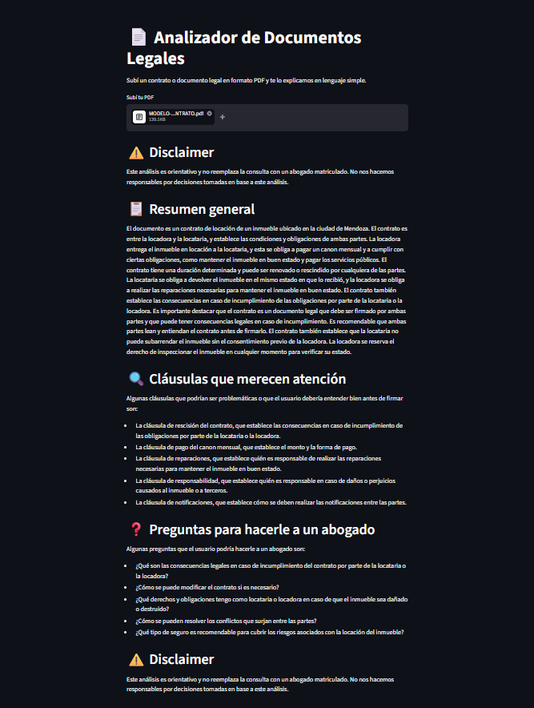

# 📄 Analizador de Documentos Legales con IA

Herramienta web que analiza contratos y documentos legales en PDF y los explica en lenguaje simple usando inteligencia artificial.



## ¿Qué hace?

- Extrae el texto de cualquier documento PDF
- Identifica cláusulas que merecen atención
- Genera preguntas para hacerle a un abogado
- Explica el contenido en lenguaje claro y simple
- Incluye disclaimer en todo momento

## Stack tecnológico

- **Python** — lenguaje principal
- **Streamlit** — interfaz web
- **Groq API** — modelo de lenguaje (LLaMA 3.3 70B)
- **PyMuPDF** — extracción de texto de PDFs
- **python-dotenv** — manejo de variables de entorno

## Instalación

```bash
# Clonar el repositorio
git clone https://github.com/tuusuario/analizador-legal.git
cd analizador-legal

# Crear entorno virtual
python -m venv venv
venv\Scripts\activate

# Instalar dependencias
pip install -r requirements.txt
```

## Configuración

Creá un archivo `.env` en la raíz del proyecto: